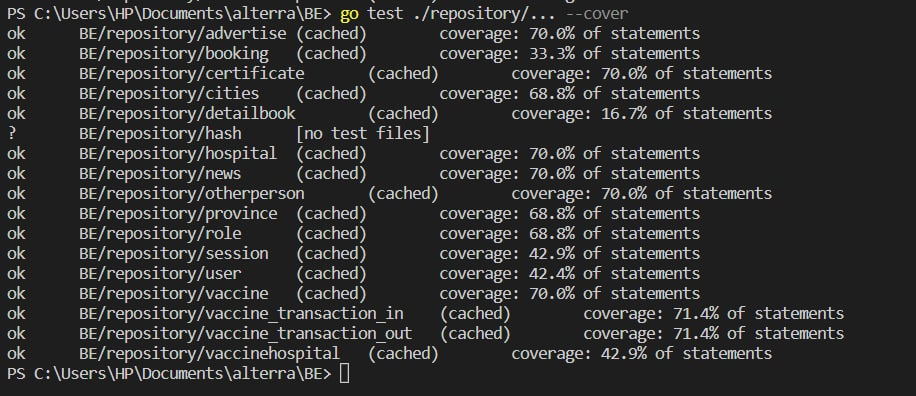
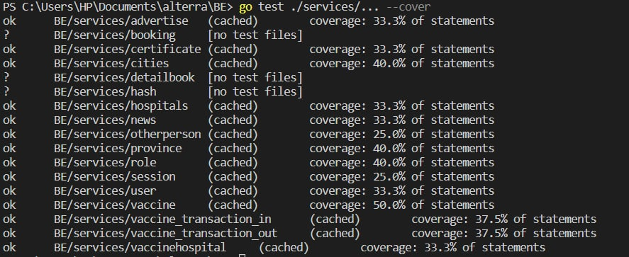
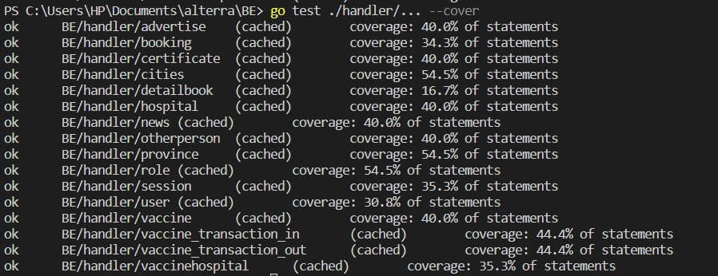

<div id="top"></div>

<div>
    <!-- Project Logo -->
    <div align="center">
        <a href="images/vaccineCaps.jpg">
            
        </a>
        <h3 align="center">
            VaccineCaps
        </h3>
    </div>
</div>

# Technology Stack


<p align="right">(<a href="#top">back to top</a>)</p>

# About the Project
<!-- Project Description -->
<div>
    <p style="text-align:left">
    Waktu belakangan ini, pemerintah dengan gencar menyuarakan vaksinasi kepada setiap orang demi mencegah penyebaran virus khususnya virus Covid-19 yang selama 2 tahun ini telah meresahkan kehidupan. Demi melancaran hal tersebut maka terciptalah aplikasi i-vaksin yang dimana mampu mengkoordinir registrasi vaksin kepada masyarakat Indonesia.
    </p>
    <p style="text-align:left">
        This application was made using the Go language and several Go libraries such as GORM, Echo.
        We used AWS cloud to deploy our application.
        So that this project can be maintained in the future, we implemented a clean code architecture.
    </p>
    <p style="text-align:left">
        Don't forget to check our Front-End repositories as well:
        <ul>
            <li><a href="https://github.com/VaccineCaps/Front-End">Front End Repository</a></li>
        </ul>
    </p>
</div>
<p align="right">(<a href="#top">back to top</a>)</p>

# Documentation
<details>
    <summary>ERD</summary>
    <div align="center">
        <a href="images/erd.jpg">
            
        </a>
    </div>
</details>

<details>
    <summary>OpenAPI</summary>
    <div align="center">
        <h3 align="center">
            <a href="https://app.swaggerhub.com/apis/Azifaazka/VaccineCaps/1.0.0#/">SwaggerHub</a>
        </h3>
    </div>
</details>

<p align="right">(<a href="#top">back to top</a>)</p>

# Project Structure
<details>
    <summary>Details</summary>

```
BE
├── configs
│   └── configs.go
├── database
│   └── database.go  
├── domain
│   └── alldomain.go 
├── handler
│   ├── advertise
│   │   ├── advertise_controller.go
│   │   └── advertise_controller_test.go
│   ├── booking
│   │   ├── booking_controller.go
│   │   └──booking_controller_test.go
│   ├── certificate
│   │   ├── certificate_controller.go
│   │   └── certificate_controller_test.go
│   ├── cities
│   │   ├── cities_controller.go
│   │   └── cities_controller_test.go
│   ├── detailbook
│   │   ├── bookingdetail_controller.go
│   │   └── bookingdetail_controller_test.go
│   ├── hospital
│   │   ├── hospitals_controller.go
│   │   └── hospitals_controller_test.go
│   ├── news
│   │   ├── news_controller.go
│   │   └── news_controller_test.go
│   ├── otherperson
│   │   ├── otherperson_controller.go
│   │   └── otherperson_controller_test.go
│   ├── province
│   │   ├── province_controller.go
│   │   └── province_controller_test.go
│   ├── role
│   │   ├── role_controller.go
│   │   └── role_controller_test.go
│   ├── session
│   │   ├── session_controller.go
│   │   └──session_controller_test.go
│   ├── user
│   │   ├── user_controller.go
│   │   └── user_controller_test.go
│   ├── vaccine
│   │   ├── vaccine_controller.go
│   │   └── vaccine_controller_test.go
│   ├── vaccine_transaction_in
│   │   ├── transactionIn_controller_test.go
│   │   └── transactionIn_controller.go
│   ├── vaccine_transaction_out
│   │   ├── transactionout_controller_test.go
│   │   └── transactionout_controller.go
│   ├── vaccinehospital
│   │   ├── vaccinehospital_controller.go
│   │   └── vaccinehospital_controller_test.go
├── helper
│   ├── middleware
│   │   ├── jwt_token.go
│   │   ├── jwt_token_check.go
│   │   ├── middleware.go
│   │   ├── parse_jwt.go
│   │   └── user_jwt.go
├── images
│   ├── erd-capstone-vaccine-Diagram FIX.drawio.png
│   ├── handlerTesting.jpeg
│   ├── repoTesting.jpeg
│   ├── serviceTesting.jpeg
│   └── vaccineCaps.jpg
├── model
│   ├── advertise.go
│   ├── booking.go
│   ├── bookingdetail.go
│   ├── certificate.go
│   ├── cities.go
│   ├── hospitals.go  
│   ├── news.go
│   ├── otherperson.go
│   ├── provinces.go
│   ├── role.go
│   ├── session.go
│   ├── user.go
│   ├── vaccine.go
│   ├── vaccine_transaction_in.go
│   ├── vaccine_transaction_out.go
│   └── vaccineshospital.go
├── repository
│   ├── advertise
│   │   ├── advertise_repository.go
│   │   └── advertise_repository_test.go
│   ├── booking
│   │   ├── booking_repository.go
│   │   └──booking_repository_test.go
│   ├── certificate
│   │   ├── certificate_repository.go
│   │   └── certificate_repository_test.go
│   ├── cities
│   │   ├── cities_repository.go
│   │   └── cities_repository_test.go
│   ├── detailbook
│   │   ├── bookingdetail_repository.go
│   │   └── bookingdetail_repository_test.go
│   ├── hospital
│   │   ├── hospitals_repository.go
│   │   └── hospitals_repository_test.go
│   ├── news
│   │   ├── news_repository.go
│   │   └── news_repository_test.go
│   ├── otherperson
│   │   ├── otherperson_repository.go
│   │   └── otherperson_repository_test.go
│   ├── province
│   │   ├── province_repository.go
│   │   └── province_repository_test.go
│   ├── role
│   │   ├── role_repository.go
│   │   └── role_repository_test.go
│   ├── session
│   │   ├── session_repository.go
│   │   └──session_repository_test.go
│   ├── user
│   │   ├── user_repository.go
│   │   └── user_repository_test.go
│   ├── vaccine
│   │   ├── vaccine_repository.go
│   │   └── vaccine_repository_test.go
│   ├── vaccine_transaction_in
│   │   ├── transactionIn_repository.go
│   │   └── transactionIn_repository_test.go
│   ├── vaccine_transaction_out
│   │   ├── transactionout_repository.go
│   │   └── transactionout_repository_test.go
│   ├── vaccinehospital
│   │   ├── vaccinehospital_repository.go
│   │   └── vaccinehospital_repository_test.go
│   ├── routes
│   │   └── routes.go
│   ├── server
│   │   └── server.go
├── services
│   ├── advertise
│   │   ├── advertise_services.go
│   │   └── advertise_services_test.go
│   ├── booking
│   │   ├── booking_services.go
│   │   └──booking_services_test.go
│   ├── certificate
│   │   ├── certificate_services.go
│   │   └── certificate_services_test.go
│   ├── cities
│   │   ├── cities_services.go
│   │   └── cities_services_test.go
│   ├── detailbook
│   │   ├── bookingdetail_services.go
│   │   └── bookingdetail_services_test.go
│   ├── hospital
│   │   ├── hospitals_services.go
│   │   └── hospitals_services_test.go
│   ├── news
│   │   ├── news_services.go
│   │   └── news_services_test.go
│   ├── otherperson
│   │   ├── otherperson_services.go
│   │   └── otherperson_services_test.go
│   ├── province
│   │   ├── province_services.go
│   │   └── province_services_test.go
│   ├── role
│   │   ├── role_services.go
│   │   └── role_services.go
│   ├── session
│   │   ├── session_services.go
│   │   └──session_services.go
│   ├── user
│   │   ├── user_services.go
│   │   └── user_services_test.go
│   ├── vaccine
│   │   ├── vaccine_services.go
│   │   └── vaccine_services_test.go
│   ├── vaccine_transaction_in
│   │   ├── transactionIn_services.go
│   │   └── transactionIn_services_test.go
│   ├── vaccine_transaction_out
│   │   ├── transactionout_services.go
│   │   └── transactionout_services_test.go
│   ├── vaccinehospital
│   │   ├── vaccinehospital_services.go
│   │   └── vaccinehospital_services_test.go
├── .env
├── Dockerfile
├── README.md
├── dockerfile
├── go.mod
├── go.sum
├── main.go
└── swagger.yaml
```
</details>
<p align="right">(<a href="#top">back to top</a>)</p>

# Unit Test
<details>
    <summary>Results</summary>
    
    
    
</details>
<p align="right">(<a href="#top">back to top</a>)</p>
    
# Contacts
- [](https://github.com/irfancahyo) [](https://www.linkedin.com/in/irfan-cahyo-ariawan-942858196/)
- [](https://github.com/Azifaazka) [](https://www.linkedin.com/in/azka-zainur-azifa-2672b71b8/)
<p align="right">(<a href="#top">back to top</a>)</p>
