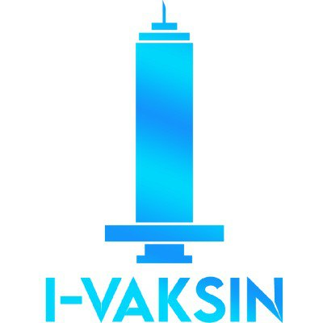

    <!-- Project Logo -->
    

        
        <h3 align="center">
            VaccineCaps
        </h3>
    

# Technology Stack

(<a href="#top">back to top</a>)

# About the Project
<!-- Project Description -->

    

    Waktu belakangan ini, pemerintah dengan gencar menyuarakan vaksinasi kepada setiap orang demi mencegah penyebaran virus khususnya virus Covid-19 yang selama 2 tahun ini telah meresahkan kehidupan. Demi melancaran hal tersebut maka terciptalah aplikasi i-vaksin yang dimana mampu mengkoordinir registrasi vaksin kepada masyarakat Indonesia.
    

    

        This application was made using the Go language and several Go libraries such as GORM, Echo.
        We used AWS cloud to deploy our application.
        So that this project can be maintained in the future, we implemented a clean code architecture.
    

    

        Don't forget to check our Front-End repositories as well:
        <ul>
            <li><a href="https://github.com/VaccineCaps/Front-End">Front End Repository</a></li>
        </ul>
    

(<a href="#top">back to top</a>)

# Documentation

    
ERD

    

        
    

